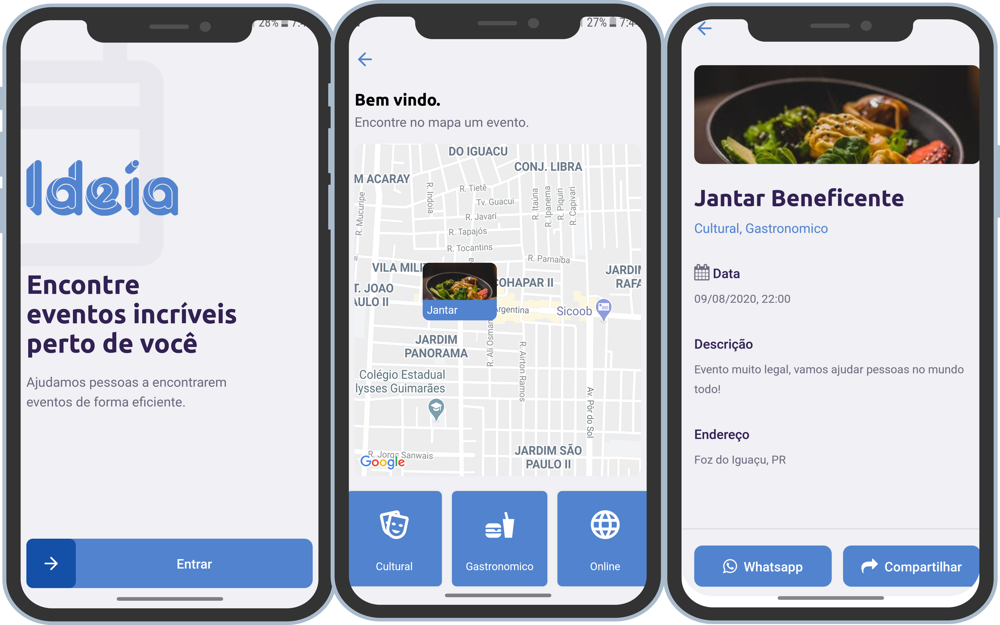

<h2 align="center">Ideia</h2>

___

  

  

___

<h3 align="center">
  <a href="#information_source-sobre">Sobre</a>&nbsp;|&nbsp;
  <a href="#interrobang-motivo">Motivo</a>&nbsp;|&nbsp;
  <a href="#mobile">Mobile</a>&nbsp;|&nbsp;
  <a href="#web">Web</a>&nbsp;|&nbsp;
  <a href="#seedling-requisitos-mínimos">Requisitos</a>&nbsp;|&nbsp;
  <a href="#rocket-tecnologias-utilizadas">Tecnologias</a>&nbsp;|&nbsp;
  <a href="#link-como-contribuir">Como Contribuir</a>&nbsp;|&nbsp;
  <a href="#licença">Licença</a>
</h3>

___

## :information_source: Sobre

A plataforma ideia é uma solução simples e eficiente que busca eventos próximos baseados na sua localização!
Veja o [video](https://www.youtube.com/watch?v=BbmJRDn0aw8) pitch apresentado por mim.

## :interrobang: Motivo

Você já foi para outra cidade e se sentiu perdido?
Todos os dias, rolam diversos eventos que você nem imagina...
Pois é, o problema é que os turistas e moradores, não sabem onde ir por falta de informação.
Nós passamos por isso e queremos resolver isso e deixar sua viagem mais completa!

## Web
<h1 align="center">
    
</h1>

## Mobile
<h1 align="center">
    
</h1>

## Mobile Video Preview
[Drive link, must be logged](https://drive.google.com/file/d/1jXblS7sQuyV4SSWDiri41Wz2kgWdjV3L/view?usp=sharing)

## :seedling: Requisitos Mínimos

Node v12.8.3
Expo v3.23.3

## :rocket: Tecnologias Utilizadas 

O projeto foi desenvolvido utilizando as seguintes tecnologias

- NodeJs
- Expo
- React Native
- TypeScript
- React
- Axios
- Knex

## :link: Como contribuir 

- Faça um Fork do repositório
- Clone o seu repositório
- Crie uma branch com a sua feature
- Faça um commit com suas mudanças
- 'Push' a sua branch
- Ir em Pull Requests do projeto original e criar uma pull request com o seu commit

## Licença 

Esse projeto está sob a licença MIT. Veja o arquivo [LICENSE](LICENSE) para mais detalhes.
